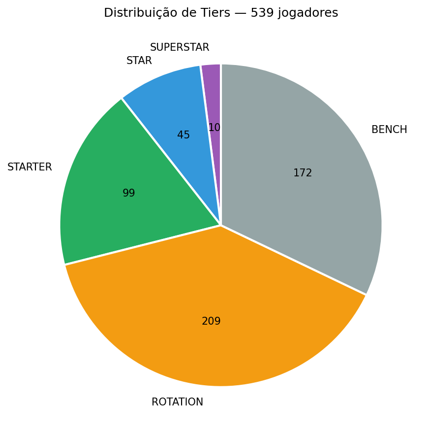
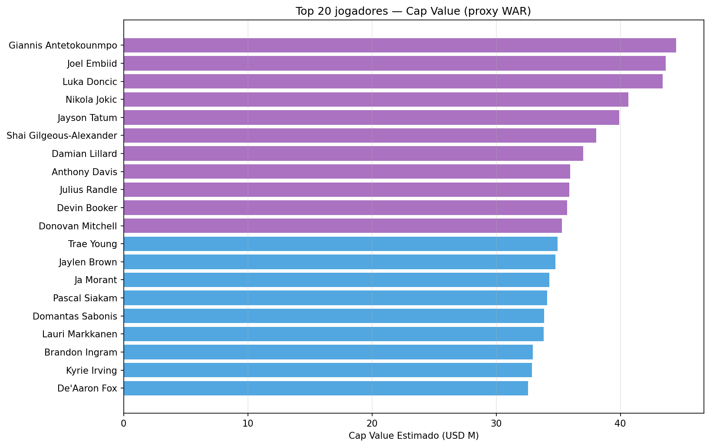

# Front Office NBA — Decisão GM

## Sumário Executivo

- **Temporada analisada:** 2022-23
- **Jogadores avaliados:** 539
- **Superstars (cap ≥ $35M):** 11
- **Stars (cap $25-35M):** 46
- **Cap atual do roster (12 jogadores):** USD 403.0M
- **Cap room disponível:** USD 50.0M

---

## 1. Distribuição de Tiers da Liga

## 2. Top 20 Jogadores por Cap Value

## 3. Free Agents Alvo (cap ≤ $50M, idade ≤ 30)

| Jogador | Idade | Tier | Efficiency | Cap Value |
|---|---|---|---|---|
| Giannis Antetokounmpo | 28 | SUPERSTAR | 43.4 | USD 44.5M |
| Joel Embiid | 29 | SUPERSTAR | 43.2 | USD 43.6M |
| Luka Doncic | 24 | SUPERSTAR | 44.0 | USD 43.4M |
| Nikola Jokic | 28 | SUPERSTAR | 39.6 | USD 40.7M |
| Jayson Tatum | 25 | SUPERSTAR | 39.5 | USD 39.9M |
| Shai Gilgeous-Alexander | 24 | SUPERSTAR | 38.6 | USD 38.1M |
| Anthony Davis | 30 | SUPERSTAR | 36.5 | USD 36.0M |
| Julius Randle | 28 | SUPERSTAR | 35.0 | USD 35.9M |
| Devin Booker | 26 | SUPERSTAR | 34.8 | USD 35.7M |
| Donovan Mitchell | 26 | SUPERSTAR | 34.4 | USD 35.3M |

## 4. Sugestões de Trade

| Target | Δ Efficiency | Δ Cap | Quem Sai | Recomendação |
|---|---|---|---|---|
| Luka Doncic | +13.1 | USD +11.7M | Zach LaVine | ⚠️ NEGOCIAR |
| Giannis Antetokounmpo | +12.5 | USD +12.8M | Zach LaVine | ⚠️ NEGOCIAR |
| Joel Embiid | +12.3 | USD +12.0M | Zach LaVine | ⚠️ NEGOCIAR |
| Nikola Jokic | +8.7 | USD +9.0M | Zach LaVine | ✅ FECHAR |
| Jayson Tatum | +8.6 | USD +8.2M | Zach LaVine | ✅ FECHAR |

---

## Metodologia

- **Cap Value (proxy WAR)**: efficiency × (min/36) × age_factor × era_factor × $1.5M
- **Age factor**: pico em 27 anos (curva gaussiana σ²=200).
- **Era factor**: ajuste inflacionário 0.5%/ano desde 2020.
- **Tiers**: SUPERSTAR ≥ $35M · STAR ≥ $25M · STARTER ≥ $15M · ROTATION ≥ $7M · BENCH < $7M.
- **Trade decision**: FECHAR (Δeff ≥ 5 + Δcap ≤ $10M), NEGOCIAR (Δeff ≥ 2), IGNORAR (resto).